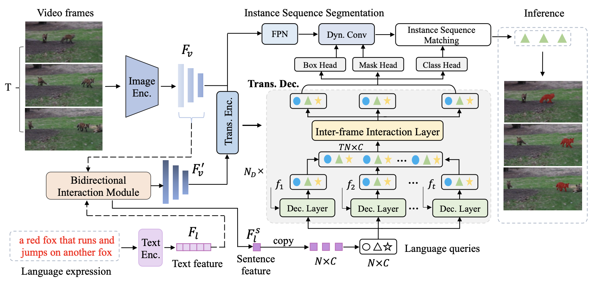

The official implementation of the paper: 

<div align="center">
<h1>
<b>
Bidirectional Correlation-Driven <br> Inter-Frame Interaction Transformer for Referring Video Object Segmentation
<!-- Language as Queries for Referring <br> Video Object Segmentation -->
</b>
</h1>

> Meng Lan, Fu Rong, Zuchao Li, Wei Yu, Lefei Zhang

</div>


<p align="center"></p>

<!-- > **Bidirectional Correlation-Driven Inter-Frame Interaction Transformer for Referring Video Object Segmentation**
>
> Meng Lan, Fu Rong, Zuchao Li, Wei Yu, Lefei Zhang -->

### Abstract

Referring video object segmentation (RVOS) aims to segment the target object in a video sequence described by a language expression. Typical multimodal Transformer based approaches process video sequence in a frame-independent manner to reduce the high computational cost, which however restricts the performance due to the lack of inter-frame interaction for temporal coherence modeling and spatio-temporal representation learning of the referred object. Besides, the absence of sufficient cross-modal interactions results in weak correlation between the visual and linguistic features, which increases the difficulty of decoding the target information and limits the performance of the model. In this paper, we propose a bidirectional correlation-driven inter-frame interaction Transformer, dubbed BIFIT, to address these issues in RVOS. Specifically, we design a lightweight and plug-and-play inter-frame interaction module in the Transformer decoder to efficiently learn the spatio-temporal features of the referred object, so as to decode the object information in the video sequence more precisely and generate more accurate segmentation results. Moreover, a bidirectional vision-language interaction module is implemented before the multimodal Transformer to enhance the correlation between the visual and linguistic features, thus facilitating the language queries to decode more precise object information from visual features and ultimately improving the segmentation performance. Extensive experimental results on four benchmarks validate the superiority of our BIFIT over state-of-the-art methods and the effectiveness of our proposed modules.


## Demo


 


 


## Requirements

We test the codes in the following environments, other versions may also be compatible:

- CUDA 11.1
- Python 3.7
- Pytorch 1.8.1


## Installation

Please refer to [install.md](docs/install.md) for installation.

## Data Preparation

Please refer to [data.md](docs/data.md) for data preparation.

## Model Zoo
### Ref-Youtube-VOS

To evaluate the results, please upload the zip file to the [competition server](https://competitions.codalab.org/competitions/29139#participate-submit_results).

| Backbone| J&F | J  | F | Model | Submission |
| :----: | :----: | :----: | :----: | :----: | :----: |
| ResNet-50 | 59.9 | 58.4 | 61.4 | [model](https://drive.google.com/file/d/1L81EeyF3LGtyOVOvaEePqv__3W2RLbl6/view?usp=drive_link) | [link](https://drive.google.com/file/d/1WMJt0rlxFKveHqp7KkEhb0OGz4P6QkNV/view?usp=sharing) |


### Ref-DAVIS17

As described in the paper, we report the results using the model trained on Ref-Youtube-VOS without finetune.

| Backbone| J&F | J  | F | Model | Submission |
| :----: | :----: | :----: | :----: | :----: | :----: |
| ResNet-50 | 60.5 | 56.9 | 64.1 | [model](https://drive.google.com/file/d/1L81EeyF3LGtyOVOvaEePqv__3W2RLbl6/view?usp=drive_link) | - |


### A2D-Sentences

| Backbone| Overall IoU | Mean IoU | mAP  | Model |
| :----: | :----: | :----: | :----: | :----: 
| ResNet-50 | 74.7 | 67.6 | 52.4 | [model](https://drive.google.com/file/d/1buypbcyAR3HqB2fFcNdpbMEMRjtqMo7K/view?usp=drive_link) |

### JHMDB-Sentences

As described in the paper, we report the results using the model trained on A2D-Sentences without finetune.

| Backbone| Overall IoU | Mean IoU | mAP  | Model |
| :----: | :----: | :----: | :----: | :----: 
| ResNet-50 | 72.1 | 71.5 | 43.0 | [model](https://drive.google.com/file/d/1buypbcyAR3HqB2fFcNdpbMEMRjtqMo7K/view?usp=drive_link) |

<!-- ## Get Started -->
## Inference

### Ref-Youtube-VOS
First, inference using the trained model.

```
python3 inference_ytvos.py --with_box_refine --binary --freeze_text_encoder --output_dir=[/path/to/output_dir] --resume=[/path/to/model_weight] --backbone [backbone] 
```
For example:
```
python3 inference_ytvos.py --with_box_refine --binary --freeze_text_encoder --output_dir=ytvos_dirs/resnet50 --resume=ytvos_r50.pth --backbone resnet50
```

Then, enter the `output_dir`, rename the folder `valid` as `Annotations`. Use the following command to zip the folder:

```
zip -q -r submission.zip Annotations
```

To evaluate the results, please upload the zip file to the [competition server](https://competitions.codalab.org/competitions/29139#participate-submit_results).


### Ref-DAVIS17
Inference using the trained model.

```
./scripts/dist_test_davis.sh [/path/to/output_dir] [/path/to/model_weight] --backbone [backbone]
```

For example:

```
./scripts/dist_test_davis.sh davis_dirs/resnet50 ytvos_r50.pth --backbone resnet50
```

### A2D-Sentences

```
python3 -m torch.distributed.launch --nproc_per_node=4 --use_env main.py --dataset_file a2d --with_box_refine --freeze_text_encoder --batch_size 2 --resume [/path/to/model_weight] --backbone [backbone]  --eval
```
For example:
```
python3 -m torch.distributed.launch --nproc_per_node=4 --use_env main.py --dataset_file a2d --with_box_refine --freeze_text_encoder --batch_size 2 --resume a2d_r50.pth --backbone resnet50 --eval
```
### JHMDB-Sentences

```
python3 -m torch.distributed.launch --nproc_per_node=4 --use_env main.py --dataset_file jhmdb --with_box_refine --freeze_text_encoder --batch_size 2 --resume [/path/to/model_weight] --backbone [backbone]  --eval
```

For example:

```
python3 -m torch.distributed.launch --nproc_per_node=4 --use_env main.py --dataset_file jhmdb --with_box_refine --freeze_text_encoder --batch_size 2 --resume a2d_r50.pth --backbone resnet50  --eval
```

## Acknowledgement

This repo is based on [ReferFormer](https://github.com/wjn922/ReferFormer). Thanks for the wonderful work.